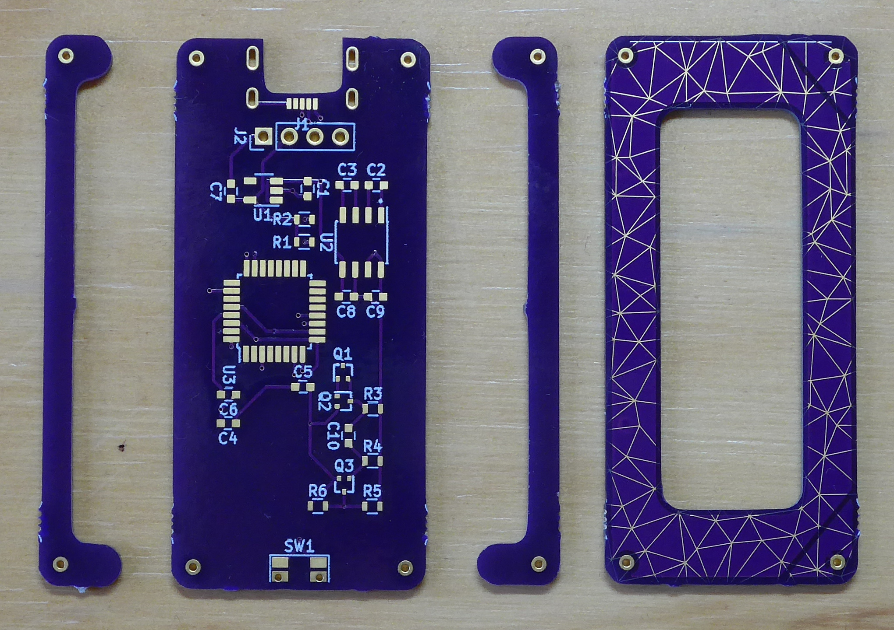
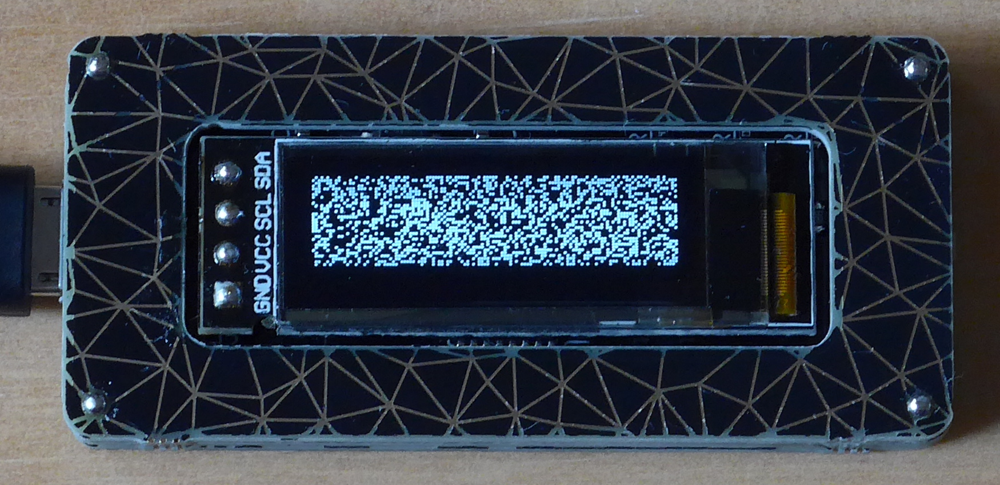

# Assembly instructions

## Materials

### Components


### Tools etc.

- Soldering iron or hot air station
- Solder wire (and paste if you're using hot air)
- Flux
- Desoldering braid
- Flush cutters
- About 50-80 mm of ~ 0.5 mm diameter wire - leads from through-hole resistors work well
- A way to flash the microcontroller - I used a [J-Link EDU Mini][jlink].

[jlink]: https://www.segger.com/products/debug-probes/j-link/models/j-link-edu-mini/

## Separate the boards

There are four boards in the design: the bottom board, which will have all the components soldered to it; two 'spacers', which do exactly what their name suggests; and the top board, which acts as a screen bezel and breaks out the two capacitive touch pads. Use a set of side cutters to cut the mouse bites connecting the boards, and clean them up with a file or some sandpaper.



## Populate the bottom board

With the four boards separated, the next job is to solder all the components (except the OLED screen) to the bottom board. My preference is for the following order:

1. Transistors (Q1-3)
2. Resistors and capacitors
3. ICs (U1-3)
4. Reset switch (SW1) and USB jack (J1)

There are lots of guides out there for SMD soldering, but some things to look out for:

- The ST662A (U2) chip package has a bevel on the side of pin 1. Note also that the 12 V output and ground pins are next to each other and there's no overcurrent protection - if you short them while the board has power, the magic smoke will come out.
- The collector pin (pin 3) of Q1 is unconnected, so the pad will lift very easily (depending on who made your boards). Don't panic if it happens, only pins 1 and 2 need to be connected!
- If you're hand soldering, remember that more flux is the answer to most problems.

Hopefully once you're done, you'll have something that looks like this:


## Flash the UF2 bootloader

As this project is based on Adafruit's [Trinket M0][trinket], we need to install the [UF2 bootloader][bootloader] for that board. The SWC and SWD pins are routed to the bottom of the board, and tacking some wires to these should be sufficient. If you don't have a J-Link on hand, there are quite a few ways to flash via SWD, such as OpenOCD on a [Raspberry Pi][piocd] or [FTDI FT232H][FT232H] breakout, or [converting][bluetobmp] a cheap STM32 'Blue Pill' to a [Black Magic Probe][bmp].

[trinket]: https://www.adafruit.com/product/3500
[bootloader]: https://github.com/adafruit/uf2-samdx1
[piocd]: https://learn.adafruit.com/programming-microcontrollers-using-openocd-on-raspberry-pi
[FT232H]: https://github.com/unprovable/FTDI-Oh-My/blob/master/FT232H-JTAG-SWD.txt
[bluetobmp]: https://medium.com/@paramaggarwal/converting-an-stm32f103-board-to-a-black-magic-probe-c013cf2cc38c
[bmp]: https://github.com/blacksphere/blackmagic

## Install CircuitPython and required libraries

If flashing was successful, resetting the boards should result in a USB mass-storage device called TRINKETBOOT appearing on your computer. It's then a simple matter of downloading the [latest release][CircuytPyDL] of CircuitPython for the Trinket, copying that to the mass storage device, and waiting until a new device called CIRCUITPY appears. You'll also need a copy of the [libraries][] that match the version of CircuitPython installed, and copy `adafruit_bus_device` (the whole directory), `adafruit_framebuf.mpy` and `adafruit_ssd1306.mpy` to the `lib` folder on the drive. In addition, `font5x8.bin` (found in the examples folder) should be copied to the root of the drive.

[CircuitPyDL]: https://circuitpython.org/board/trinket_m0/
[libraries]: https://circuitpython.org/libraries

## Test the screen

Before you finish assembly, test the screen! It'll be really hard to get to any of the components once everything is put together. Put the following into `code.py` (or use the REPL).

``` python
import board
import busio
import adafruit_ssd1306

i2c = busio.I2C(board.SCL, board.SDA)
oled = adafruit_ssd1306.SSD1306_I2C(128, 32, i2c)

oled.text('Hello world!', 0, 0, 1)
oled.show()
```

Insert the screen into the connector, hold it on an angle to ensure there's an electrical connection, and run the code. Hopefully the screen will greet you.


## Build the PCB stack

Now that everything's working, the boards can be stacked to make the enclosure. Cut the wire into four segments, insert them into the bottom PCB, and solder them from the bottom side:


Thread the spacers onto the wires - make sure they're the right way around! The shorter arm should be located on the same side as the USB connector. You can solder these in place, but use as little as possible so that the top board can sit flush.


Finally, put the top board in place, paying attention to direction. The top of the board has two diagonal lines in the top left and right of the board, which act as the capacitive touch points. Solder in place.


## Attach the screen

The screen fits best if you remove the plastic from the four-pin header. Pliers should do this pretty well, and you can then have the screen sitting on top of the microcontroller. Solder the screen in place.


## All done!

In the spirit of the Club, finish all the through-hole joints with beautiful [solder domes][domes], and your random number generator is ready to receive code!

[domes]: https://boldport.com/blog/2014/03/making-beautiful-solder-points.html


