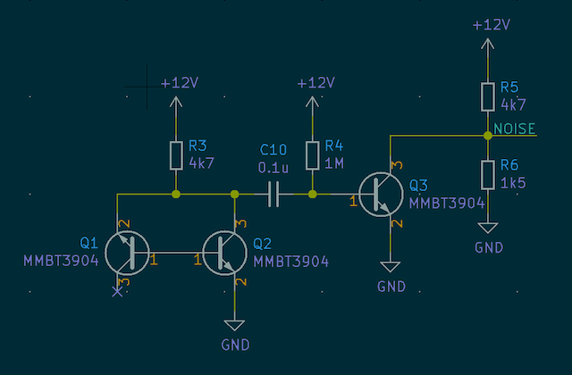

# CircuitPython Random Number Generator

This is my contribution to the Boldport Club's community run Board Swap Project, a hardware random number generator that uses avalanche noise to make patterns and roll dice. Apart from being part of the community project, my other motivations were interest in randomness and the processes that can be used to generate it, along with the idea of using PCBs to build an enclosure.

**Please note that I made this for fun - if you need random numbers for anything important, this isn't the project you're looking for.**

## Operation

A ST662 charge pump produces the 12 V required to reverse-bias Q1, which produces the actual randomness. When electrons travel through this junction, Q2 allows current to flow to ground. This signal is amplified by Q3, run through a voltage divider, and fed into the ADC of an ATSAMD21E18 microcontroller, which has been flashed with the [Adafruit Trinket M0][trinket] bootloader to allow programming with CircuitPython.

[trinket]: https://www.adafruit.com/product/3500

The display is an inexpensive 128 × 32 SSD1306-based OLED, and the in-built capacitive touch that's on the Trinket M0 hardware is routed to the top left (pin A3) and right (A4) corners of the top PCB to allow for input. If you don't have KiCad, you can use the [PDF schematic][schematic] - it's all pretty simple.

[schematic]: schematic.pdf

## Making your own

You can use the KiCad files in the 'hardware' directory to generate gerbers and get them made at your favourite PCB fab. I had my prototypes made at [OSH Park][oshpark] (who accept the `.kicad_pcb` file directly), and once I'd finished the final design, got a 'protopack' made at [Dirty PCBs][dirtypcbs]. The gerbers are available in a [zip file][zip] which should be accepted by most fabs, and assembly instructions can be found [here][assembly]. Make sure the PCB thickness is 1.6 mm - Dirty PCBs default to 1.2 mm, which will cause clearance issues.

[oshpark]: https://www.oshpark.com/
[dirtypcbs]: https://dirtypcbs.com/store/pcbs/
[assembly]: assembly.md
[zip]: hardware/gerbers/rng-pcb-dirtypcbs.zip

## Credits

This project was only possible thanks to the electrical designs, libraries, and articles written by others. Many thanks to the people below whose work was used to build this project, and to the Boldport Club Discord for the inspiration to build something and the help and support they're always happy to provide.

- Adafruit's [Trinket M0 schematic][m0schem], which I shamelessly copied for the microcontroller and its supporting components. I've also used Adafruit's bootloader (and consequently their USB VID and PID), so this project is strictly a DIY build. Please don't distribute finished versions of this project with the Adafruit bootloader installed.
- Aaron Logue's [Hardware Random Number Generator][aaronl] started me on the path towards making the project, and gave the basic circuit.
- Giorgio Vazzana's [amazing writeup][giorgiov] of his experiments with this design, including precise measurements of transistor breakdown voltages, analogue and digital output circuits, and rigorous testing of the output.
- Walter Anderson's [Google Sites][waltera] page has a lot of really interesting information on entropy, both from this design and others.
- Rob Seward's [Arduino Uno design][robs] feeds the output from the noise circuit into an ADC and uses software to produce the actual random bits, an approach I mostly copied.
- The pattern on the top PCB (`triangle_pattern.kicad_mod`) is made with Quinn Rohlf's [Trianglify][trianglify] library.
- The `mouse-bite-2mm-slot.kicad_mod` footprint comes from [this repository][madworm] by madworm.

[m0schem]: https://learn.adafruit.com/assets/45723
[aaronl]: http://www.cryogenius.com/hardware/rng/
[giorgiov]: http://holdenc.altervista.org/avalanche/index.html
[waltera]: https://sites.google.com/site/astudyofentropy/project-definition/avalanche-noise
[robs]: http://robseward.com/misc/RNG2/
[trianglify]: https://github.com/qrohlf/trianglify
[madworm]: https://github.com/madworm/Panelization.pretty
